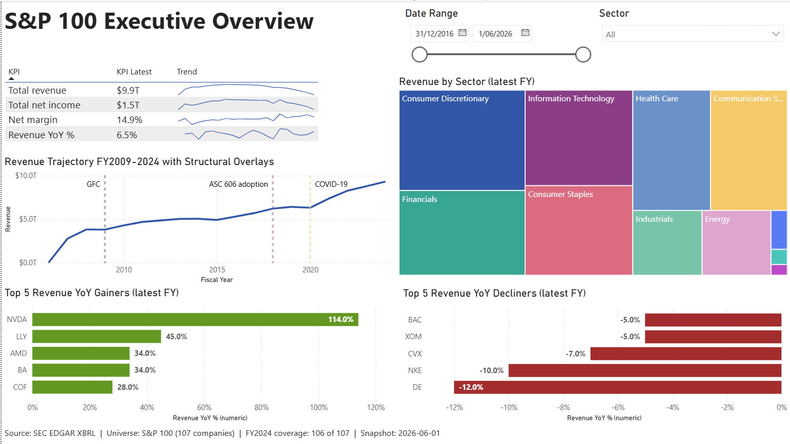
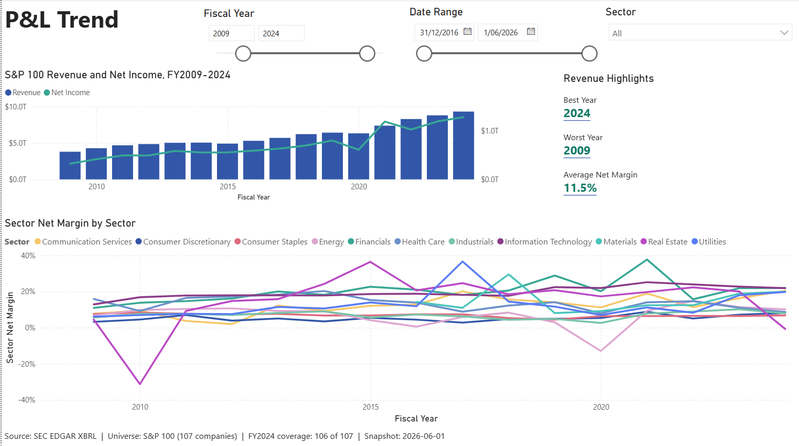
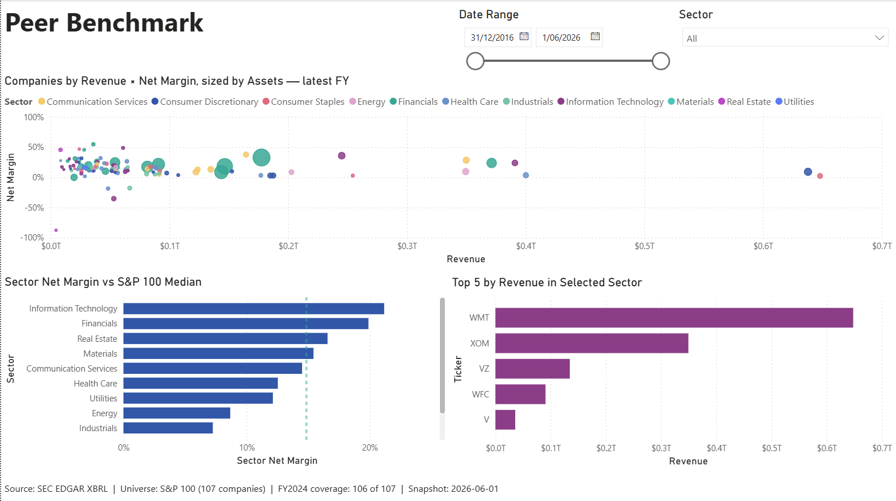
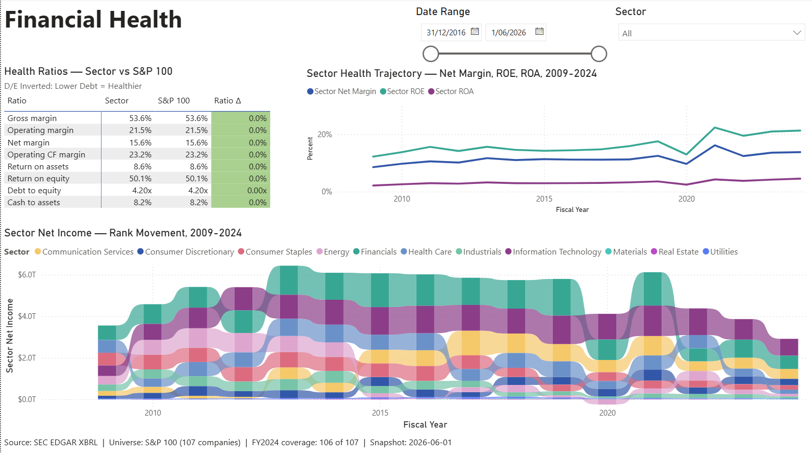
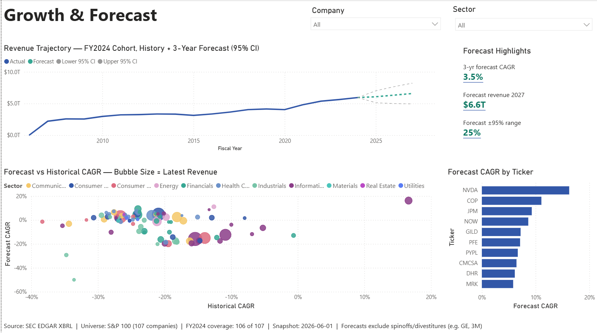
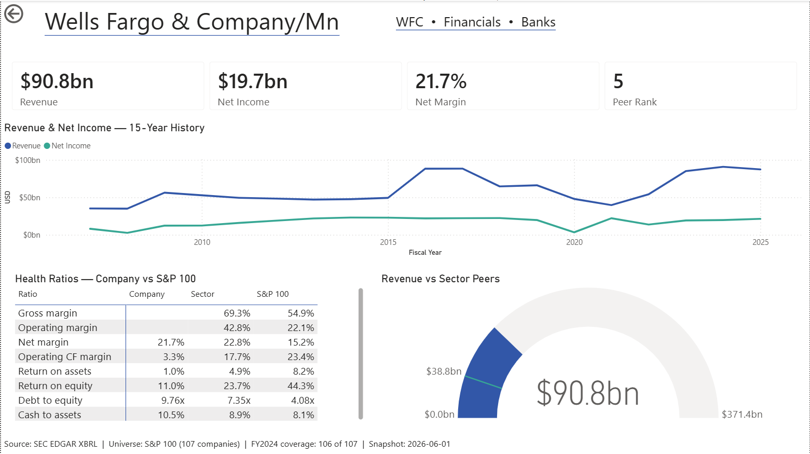

# financial-analytics-lakehouse-project

> AWS-native data lakehouse — SEC EDGAR financial data → Data Vault 2.0
> medallion (S3 + Glue + Athena) → 6-page Power BI executive suite →
> Step Functions orchestration → keyless GitHub OIDC CI/CD.
> Project #3 of Phil's data engineering portfolio.

**Status: COMPLETE — 2026-06-05.** End-to-end and interview-ready: Bronze (S3 raw SEC EDGAR) → Data Vault 2.0 warehouse (Glue / Athena / Iceberg) → canonical Gold marts → 6-page Power BI executive suite → AWS Step Functions orchestration → keyless GitHub OIDC CI/CD with a dbt-build-plus-verify gate. Full build history, design decisions and the risk log live in `PROJECT_CONTEXT.md` and `LEARNINGS.md`.

## What this project is

The third project in a portfolio sequence demonstrating end-to-end data
engineering work. Project #3 ingests US public-company corporate-finance
data from the SEC EDGAR API, models it as Data Vault 2.0 inside a Bronze
/ Silver / Gold medallion architecture on AWS-native infrastructure, and
surfaces it through a polished 6-page Power BI report.

Full architecture, decision history, and phase-by-phase delivery plan in
`PROJECT_PLAN.md`. Running session state in `PROJECT_CONTEXT.md`.

## Stack

| Layer | Choice |
|---|---|
| Cloud | AWS (us-east-1) |
| Object storage | Amazon S3, prefix-partitioned by zone + extract date |
| Metastore | AWS Glue Data Catalog |
| Query engine | Amazon Athena |
| Transformation | dbt-athena |
| Orchestration | AWS Step Functions |
| Modeling | Data Vault 2.0 inside Bronze / Silver / Gold medallion |
| BI | Power BI Desktop, Import mode .pbix |

## Project structure

```
financial-analytics-lakehouse-project/
├── dbt/                    # dbt-athena project
│   ├── models/
│   │   ├── staging/        # stg_* (Bronze JSON → typed columns)
│   │   ├── intermediate/   # int_* (concept extraction + canonical mapping)
│   │   ├── warehouse/      # Data Vault 2.0 hubs / links / satellites
│   │   ├── business_vault/ # PIT + bridge
│   │   └── marts/          # Gold: P&L trend, peer benchmark, health, forecast
│   ├── seeds/              # canonical-concept dictionary + S&P 100 roster
│   └── tests/              # singular + cross-mart data tests
├── scripts/                # Python: SEC extract, forecast, Glue dbt runner, deploy
├── sql/                    # ddl / diagnostic / verify / audit query packs
├── stepfunctions/          # Step Functions state machine definition
├── iam/                    # IAM policy documents
├── powerbi/                # financial_analytics.pbix + screenshots/
├── audit/                  # data-quality audit notes
├── .github/workflows/      # deploy.yml — keyless OIDC CI/CD
└── *.md                    # PROJECT_PLAN, PROJECT_CONTEXT, *_PIPELINE walkthroughs, LEARNINGS
```

## How this project was built

This project was built using AI-assisted pair programming (Claude by Anthropic).
All architecture decisions, technology selections, and final design choices are
my own; the AI accelerated implementation and acted as a senior-DE code reviewer.
The intent of the project is portfolio learning — every component was built with
explicit understanding of what it does and why. Layer-by-layer
walkthroughs live in the `*_PIPELINE.md` files; decision records and
diagnosis → fix → lesson loops are in `LEARNINGS.md`.

## Project documents

- `PROJECT_PLAN.md` — locked stack, decisions, phase delivery plan
- `PROJECT_CONTEXT.md` — running session state + full build history
- `DBT_PIPELINE.md` / `GOLD_MARTS_PIPELINE.md` / `ORCHESTRATION_PIPELINE.md` — layer walkthroughs
- `ENGINEERING_STANDARDS.md` — 10-criteria per-script audit
- `LEARNINGS.md` — diagnosis → fix → lesson loops (62 risks banked)

## Dashboard

Six interactive pages built in Power BI Desktop on the dbt Gold marts. Import
storage mode — the `.pbix` opens standalone for reviewers. Live report:
`powerbi/financial_analytics.pbix`.

### Executive Overview



Universe headline KPIs — Total Revenue, Net Income, Net Margin and Revenue YoY %
at the latest complete fiscal year ($9.9T / $1.5T / 14.9%) — over a multi-year
revenue trend, with top revenue movers and margin/return scatters. Slicer-
responsive by sector.

### P&L Trend Deep-Dive



Long-run revenue, net income and margin trends across fiscal years, with sector
and company breakdowns.

### Peer Benchmarking



Company-versus-peer comparison on the headline financials, ranking constituents
within their sector and against the S&P 100.

### Financial Health



Eight canonical ratios in a Sector vs S&P 100 matrix with traffic-light
formatting; a net-income rank-movement ribbon chart (2009-2024); and a
multi-ratio sector trajectory line (net margin / ROE / ROA).

### Growth & Forecast



A cohort-locked revenue trajectory — solid actuals → dashed forecast → 95%
confidence fan — plus a forecast-highlights KPI strip, a historical-vs-forecast
CAGR acceleration scatter, and a Top 10 forecast-CAGR bar.

### Company Detail (drill-through)



Per-company drill-through: a KPI strip, a 15-year P&L line, an 8-ratio
Company / Sector / S&P 100 matrix, and a revenue-vs-sector gauge. Reached by
drilling from the Executive Overview top-movers and scatters.
